# Realidad Virtual usando Google Daydream y Unity

La realidad virtual es cada vez más importante y reelevante en nuestras vidas. Por esto es un placer compartir con usted esta corta guía de cómo iniciar a usar el DSK de Google Daydream con Unity para crear un Video Juego con Realidad Virtual.

## Requisitos:

* Asegúrese de tener instalado [Unity 5.6](https://unity3d.com/get-unity/download) o superior.
* Al instalarlo, asegúrese de activar "Android Build Support" y "iOS Build Support".
* Descargue el [Google VR SDK para Unity](https://developers.google.com/vr/unity/download#google-vr-sdk-for-unity).

Si usted se encuentra en un taller o en un salón de clases, busque los archivos en el escritorio del computador.

* Necesitará un Google Cardboard o dispositovo Daydream con un teléfono para probar el juego.

## Inicio

1. Cree un nuevo proyecto 3D en Unity.

2. Familiarcese con la pantalla, solicite ayuda si lo cree necesario.
3. Ingrese un nuevo plano, desde el menú GameObject/3D Object/Plane o click derecho en el panel de Hierarchy 3D Object/Plane.

4. Agregue un cubo al juego.

5. Asegúrese de que las posiciones son las siguientes:
- Plano: 0, 0, 0
- Cubo: 0, 0.5, 0
- Camara: 0, 1, -10

6. De click en play, para que vea cómo va quedando. Para regresar a la vista de edición de la escena click en play nuevamente.

Note que en este momento tenemos una vista panorámica similar a la de cualquier juego 3D.
7. En el menú seleccione File / Save Scenes y nombrela algo como "First scene", deberá quedar en el folder Assets.

## Importar Daydrean SDK

1. Desde el menú Assets / Import Package / Custom Package y seleccione el archivo que descargamos "GoogleVRForUnity.unitypackage".
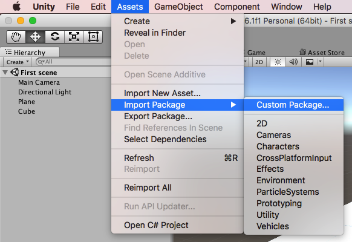
2. Seleccione Open, y luego Import.
3. Si Unity pide algún "API upgrade" seleccione que si.

## Configuración según plataforma

### Si su celular es Android

1. Desde el menú, seleccione File / Build Settings.
2. En la lista de plataformas, seleccione Android y de click en "Switch Platform".
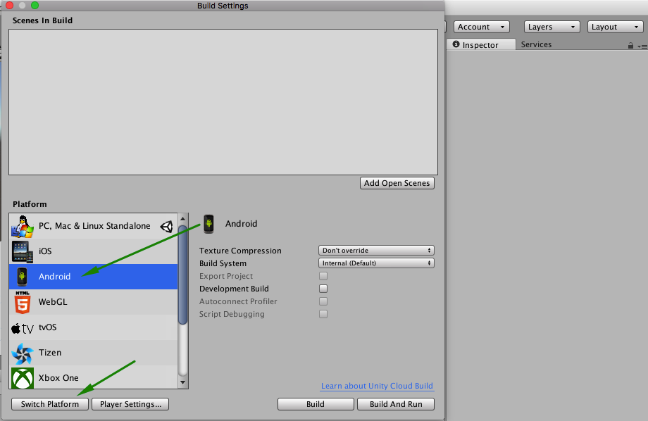
3. Una vez que el proceso termine, haga click en "Player Settings" para mostrar las opciones en el panel derecho, "Inspector".
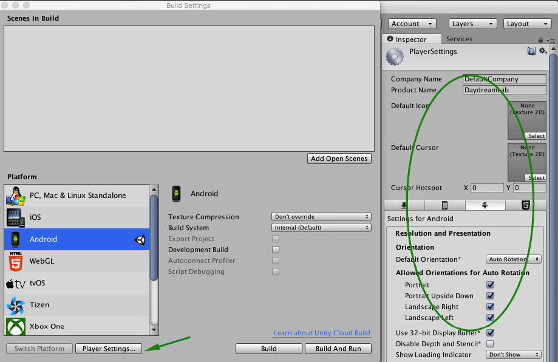
4. En el Inspector, "Other Settings", active la opción "Virtual Reality Suported". En la lista de SDKs, agregue "Cardboard".
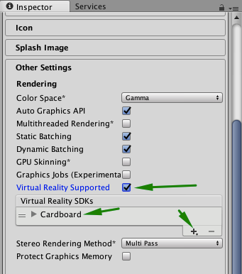
5. Más abajo en esa misma categoría, cambie la opción Identification / Package Name. Esta debe tener la configuración de un dominio a la inversa, si necesita ayuda solicítela, esta debe ser única.
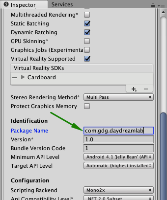
6. En la opción "Minimum API Level", seleccione la opción "Android 4.4 'Kit Kat' (API level 19)".
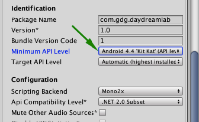
7. Si en algún momento Unity le pide la ubicación del Android SDK, pida ayuda si la necesita.

### Si su celular es iOS

1. Desde el menú, seleccione File / Build Settings.
2. En la lista de plataformas, seleccione iOS y de click en "Switch Platform".

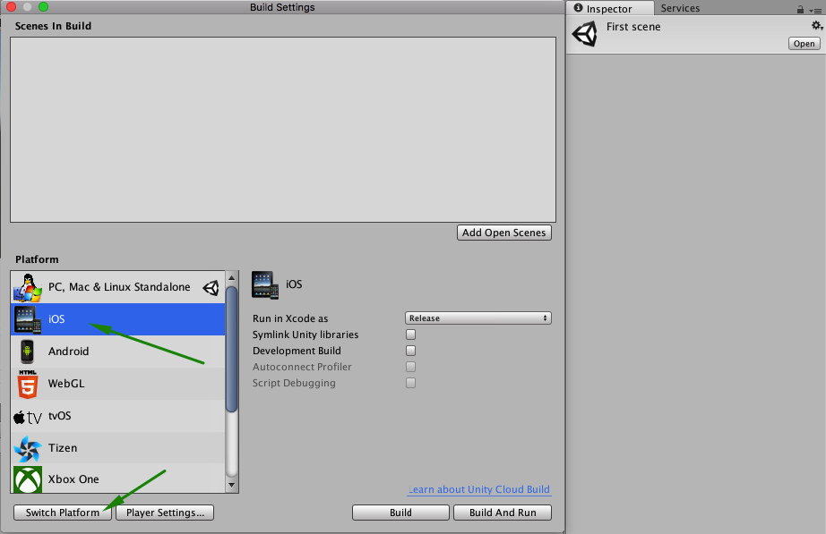
3. Una vez que el proceso termine, haga click en "Player Settings" para mostrar las opciones en el panel derecho, "Inspector".
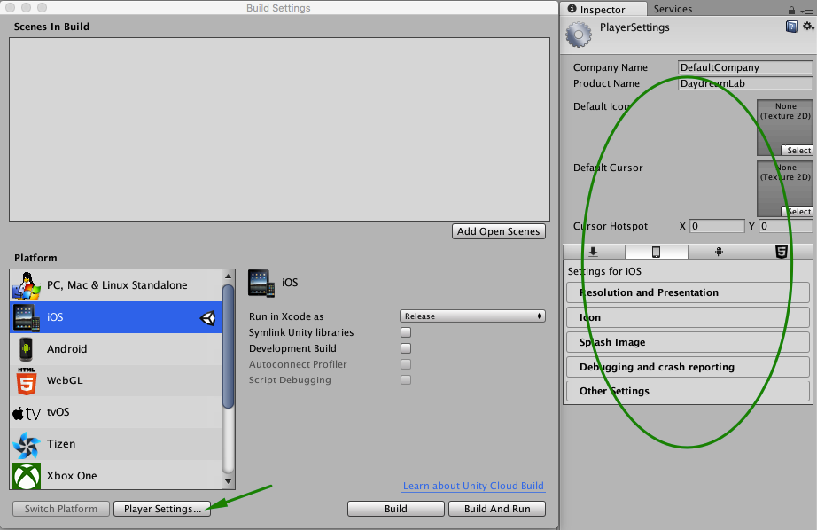
4. En el inspector, "Resolution and Presentation", en las opciones de "Allowed Orientations for Auto Rotation", selecciones solamente "Landscape Left".
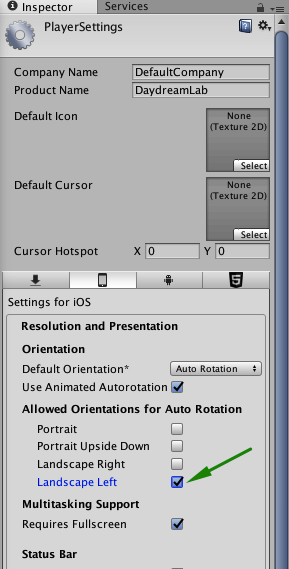
5. Más abajo en la categoría "Other Settings", active la opción "Virtual Reality Suported". En la lista de SDKs, agregue "Cardboard".

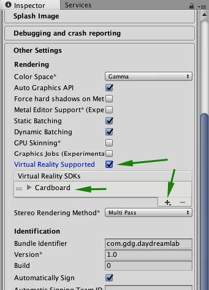
6. Más abajo en la misma categoría "Other Settings", cambie la opción Identification / Bundle Identifier. Esta debe tener la configuración de un dominio a la inversa, si necesita ayuda solicítela, esta debe ser única.

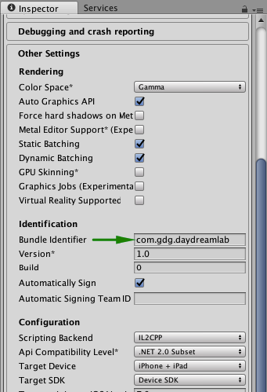

## Demostración

1. Cierre las ventanas de opciones.
2. Conecte por medio USB su teléfono a su computadora.
3. En los Assets, se encontrará unos scenes de ejemplo en GoogleVR / Demos / Scenes.
4. Seleccione la escena GVRDemo, dele doble click para abrirla.
5. Desde el menu, seleccione File / Build and Run.

