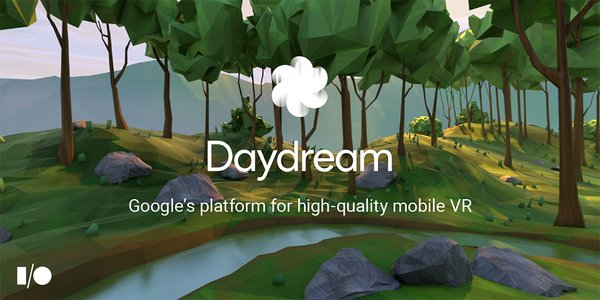
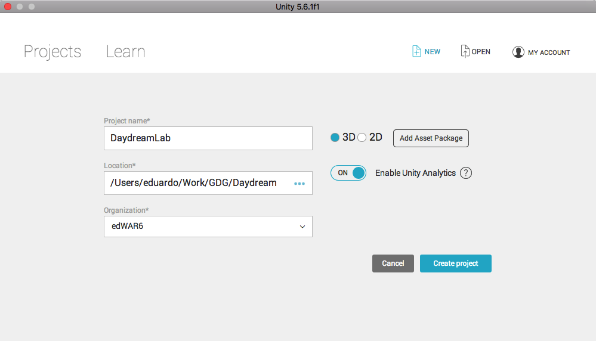
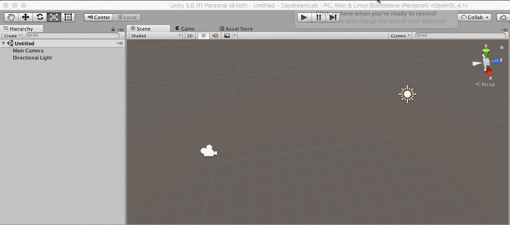
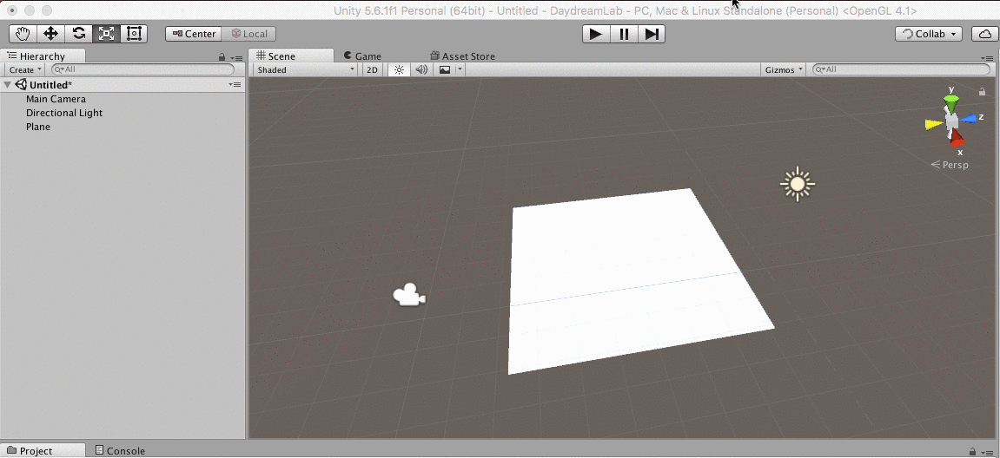
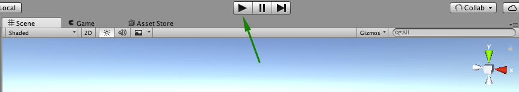
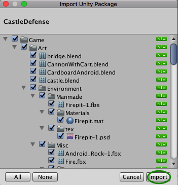

# Realidad Virtual usando Google Daydream y Unity

La realidad virtual es cada vez más importante y reelevante en nuestras vidas. Por esto es un placer compartir con usted esta corta guía de cómo iniciar a usar el DSK de Google Daydream con Unity para crear un Video Juego con Realidad Virtual.

## Requisitos:

* Asegúrese de tener instalado [Unity 5.6](https://unity3d.com/get-unity/download) o superior.
* Al instalarlo, asegúrese de activar "Android Build Support" y "iOS Build Support".
* Descargue el [Google VR SDK para Unity](https://developers.google.com/vr/unity/download#google-vr-sdk-for-unity).

Si usted se encuentra en un taller o en un salón de clases, busque los archivos en el escritorio del computador.

* Necesitará un Google Cardboard o dispositovo Daydream con un teléfono para probar el juego.

## Inicio

1. Cree un nuevo proyecto 3D en Unity.

2. Familiarcese con la pantalla, solicite ayuda si lo cree necesario.
3. Ingrese un nuevo plano, desde el menú GameObject/3D Object/Plane o click derecho en el panel de Hierarchy 3D Object/Plane.

4. Agregue un cubo al juego.

5. Asegúrese de que las posiciones son las siguientes:
- Plano: 0, 0, 0
- Cubo: 0, 0.5, 0
- Camara: 0, 1, -10

6. De click en play, para que vea cómo va quedando. Para regresar a la vista de edición de la escena click en play nuevamente.

Note que en este momento tenemos una vista panorámica similar a la de cualquier juego 3D.
7. En el menú seleccione File / Save Scenes y nombrela algo como "First scene", deberá quedar en el folder Assets.

## Daydrean SDK

3. Descargue [los assets](https://goo.gl/rgJF7F) para el proyecto. Si se encuentra en un laboratorio o un salón de clases, estos archivos podrá encontrarlos en el escritorio.
4. De doble click a los assets, llamados "CastleDefense.unitypackage", asegúrese de que todos estén marcados y seleccione import.

5. Cree un plano
